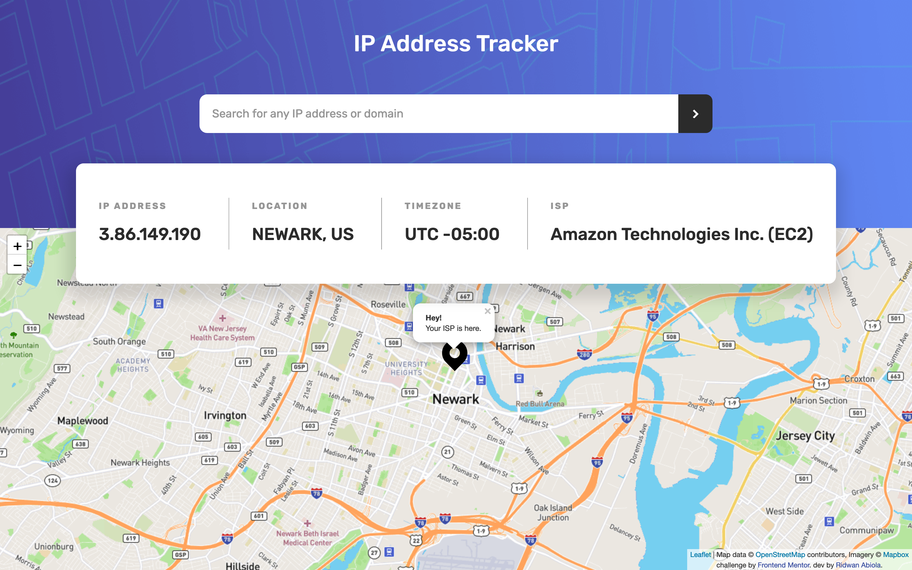
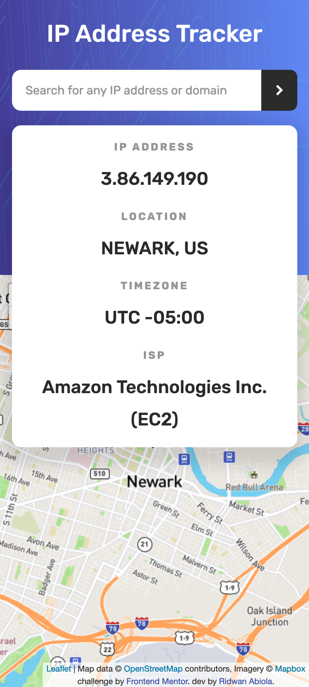

# Frontend Mentor - IP address tracker

A personal solution to [IP address tracker challenge on Frontend Mentor](https://www.frontendmentor.io/challenges/ip-address-tracker-I8-0yYAH0). Frontend Mentor challenges help you improve your coding skills by building realistic projects.

## Table of contents

- [Overview](#overview)
  - [The challenge](#the-challenge)
  - [Screenshot](#screenshot)
  - [Links](#links)
- [My process](#my-process)
  - [Built with](#built-with)
- [Author](#author)
- [Acknowledgments](#acknowledgments)

## Overview

This uses ipify API to get information about a visitors ISP. Users' can also search IP/domain address.

### The challenge

Users should be able to:

- View the optimal layout for the site depending on their device's screen size
- See hover states for all interactive elements on the page
- See their own IP Address on the map on the initial page load
- Search for any IP addresses or domains and see the key information and location

### Screenshot




### Links

- Solution URL: [FM Solution](https://www.frontendmentor.io/challenges/room-homepage-BtdBY_ENq/hub/flat-design-cosy-room-homepage-with-960-grid-system-Wn4I5dILO)
- Live Site URL: [Cosy Room Homepage: (github pages)](https://abu-hasib.github.io/iptrack/)
- Live Site URL: [Cosy Room Homepage: (vercel)](https://iptrack.vercel.app/)

## My process

I went with the vanilla way. Even though it took longer but it was worth it. I got to play around with different way doing things.

I followed these steps but still overlapped as time went by.

    Fleshed out the html
    Wrote the styles
    Added interactivity

### Built with

- Ipify API
- Leaflet JS
- Mapbox
- CSS custom properties

### What I learned

async/await - good for API calls where response is delayed.

harnessing the power of Intersection Observers for animating when a certain content is in view of the current device

```js
async function main() {
	const data = await fetch(URL)
		.then((response) => response.json())
		.catch((error) => console.error(error));
}

// code continues running even though request not yet fulfilled.
```

## Author

- Website - [Ridwan](https://ridwanabiola.netlify.app/)
- Frontend Mentor - [@abu-hasib](https://www.frontendmentor.io/profile/abu-hasib)

## Acknowledgments

- Leaflet JS - Checkout [Leaflet JS ](https://leafletjs.com/)
- Ipify - Checkout [ Ipify ](https://leafletjs.com/)
- Ridwan Abiola - Checkout [Ridwan's portfolio](https://ridwanabiola.netlify.app/)
